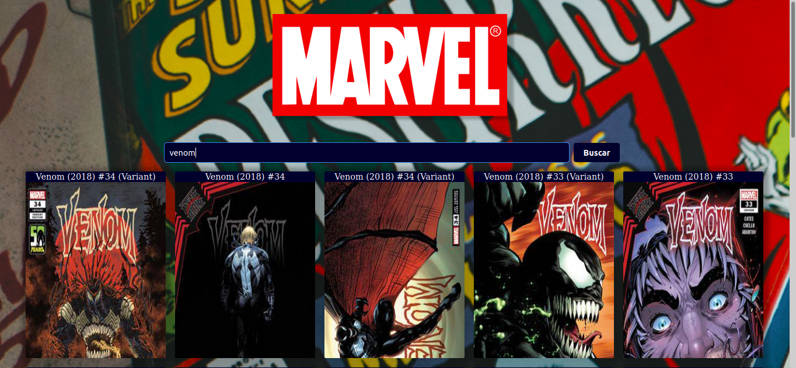

# Projeto Marvel

Lista as revistas em quadrinhos dos personagens da Marvel 
podendo buscar por um nome específico.


## Referencia da API
* [Api marvel unlimited](https://developer.marvel.com/) <br />
#### Get all items

```http
  GET /v1/public/comics
```

| Parameter | Type     | Description                |
| :-------- | :------- | :------------------------- |
| `publicKey` | `string` | **Required**. Sua chave publica da api |
| `privateKey` | `string` | **Required**. Sua chave privata da api |


  
## Dependências

 - npm ou yarn
 - axios
 - md5

```bash 
  npm i axios
  npm i md5
```
    
## Tecnologias usadas

**Client:** React, CSS

**Server:** Axios, md5

**Layout:** Figma

  
## Layout

 <br />

## Conclusão do projeto <br />
 <br />
